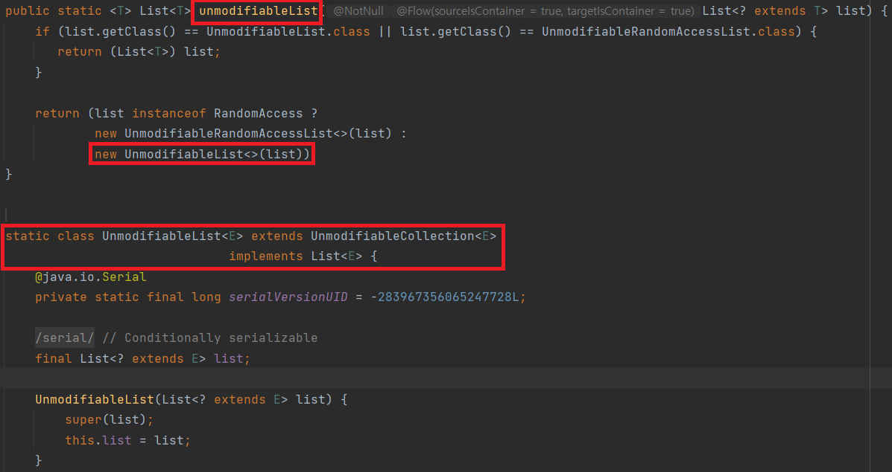
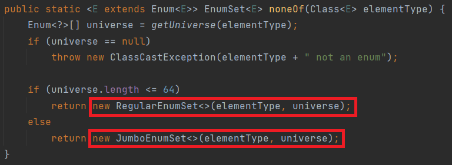

## 🔎 정적 팩터리 메서드(static factory method)
클라이언트가 클래스의 인스턴스를 얻는 수단은 다음과 같다
1. public 생성자
```
public class Foo {

    private String name;
	
    // 생성자를 통한 인스턴스 생성
    public Foo(String name) {
    	this.name = name;
    }
}
```

2. 정적 팩터리 메서드(static factory method)  
```
public class Foo {

    private String name;
	
    // 생성자를 통한 인스턴스 생성
    public Foo(String name) {
    	this.name = name;
    }
    
    // 정적 팩터리 메서드를 통한 인스턴스 생성
    public static Foo withName(String name) {
        return new Foo(name);
    }
}
```
> `주의`: 클래스의 인스턴스를 단순히 반환하는 정적 팩터리 메서드는 디자인 패턴에서의 팩터리 메서드(Factory method)와는 다르다

## ✔️ 정적 팩터리 메서드의 장점
- 클래스는 클라이언트에 public 생성자 대신 (혹은 생성자와 함께) 정적 팩터리 메서드를 제공할 수 있다
#### 1. 이름을 가질 수 있다
- 이름을 잘 지으면 반환될 객체의 특성을 쉽게 묘사가능하다
    - `예시`:  생성자의 **BigInteger** vs 정적 팩터리 메서드의 **BigInteger.probablePrime**

만일, 생성자가 하나의 시그니처로는 생성자를 하나만 만들 수 있다는 제약을 피하기 위해 입력 매개변수의 순서를 다르게 작성하는 방식을 사용한다면, API를 사용하는 개발자 입장에서는 각 생성자가 어떤 역할을 하는지 정확히 기억하기 어려울 것이다.  
이에, 한 클래스에 시그니처가 같은 생성자가 여러 개 필요할 것 같으면, 생성자를 정적 팩터리 메서드로 변경하고 차이나는 이름을 지어주자.
```
public class ProsA {

    private String name;

    // 생성자 (이름을 가질 수 없다)
    public ProsA(String name) {
        this.name = name;
    }

    // 정적 팩토리 메서드 (반환되는 객체의 특성을 설명하는 이름을 가질 수 있다)
    public static ProsA withName(String name) {
        return new ProsA(name);
    }

    public static void main(String[] args) {
        // 생성자 - 객체의 특성을 명확히 설명하지 못함
        ProsA c1 = new ProsA("hunseong");

        // 정적 팩토리 메서드 - hunseong이 Foo의 name으로 지정됨이 명확함
        ProsA c2 = ProsA.withName("hunseong");
    }
}
```  

#### 2. 호출 때마다 인스턴스를 새로 생성할 필요가 없다
- 미리 만들어 놓은 인스턴스를 사용한다던가, 새로 생성한 인스턴스를 캐싱하여 재활용 하는 방식으로 불필요한 객체 생성을 피한다  
예를 들어, 다음과 같은 `Boolean.valueOf(boolean)` 메서드는 아래와 같이 객체를 생성하지 않는다.
```
public static Boolean valueOf(boolean b) {
	return b ? Boolean.TRUE : Boolean.FALSE;
}
```

또한, `BigInteger`는 int(4byte) 와 long(8byte) 로 표기 가능한 범위를 나타내기 위한 클래스이다. 다음과 같이 자주 사용되는 숫자에 한해서 객체를 미리 생성해두고 반환한다. (캐싱)
```
public class BigInteger extends Number implements Comparable<BigInteger> {
    ...
    public static final BigInteger ZERO = new BigInteger(new int[0], 0);
    public static final BigInteger ONE = valueOf(1);
    public static final BigInteger TWO = valueOf(2);
    private static final BigInteger NEGATIVE_ONE = valueOf(-1);
    public static final BigInteger TEN = valueOf(10);
    ...
}
``` 

위의 방식을 통해 생성 비용이 큰 객체가 자주 요청되는 상황에 성능을 끌어올려 준다.  
> 🪽 플라이웨이트 패턴(Flyweight pattern)  
인스턴스를 가능한 대로 공유시켜 new 연산자를 통한 메모리를 절약하는 패턴이다. 공통 부분을 `Flyweight`로 선언하고 `FlyweightFactory`를 사용하여 `Flyweight`의 인스턴스를 생성 또는 공유한다.

```
public class RandomNum {
    private static final String MIN = 1;
    private static final String MAX = 10;

    private static Map<String, RandomNum> randCache = new HashMap<>();

    static {
        IntStream.range(MIN, MAX)
                    .forEach(i -> randCache.put(i, new RandomNum(i)));
    }

    private int number;

    private RandomNum(int number) {
        this.number = number;
    }

    public RandomNum of(int number) { // RandomNum을 반환하는 정적 팩토리 메서드
        return randCache.get(number); 
    }
}
```
또 다른 예시로는, 위의 코드처럼 미리 생성된 랜덤 숫자의 캐싱을 통해 객체 생성을 통제할 수 있다는 장점이 있다. 생성자의 접근 제한자를 `private` 으로 설정함으로써, 팩터리 메서드를 통해서만 객체 생성을 가능하게끔 제한한다.  

이를 통해 얻을 수 있는 장점은 다음과 같다.  
1. 클래스를 싱글턴(Singleton)으로 생성가능하다
    - `private` 으로 객체 생성을 막고 메서드를 통해 항상 같은 객체를 생성함으로써 무상태 객체를 만든다
2. 클래스를 인스턴스화 불가로 생성할 수 있다
    - `private`` 기본 생성자를 추가하면서, 인스턴스화를 방지한다
3. 불변 값 클래스에서 동치 인스턴스가 하나임을 보장할 수 있다
    - `a == b`일때만 `a.equals(b)`가 성립한다
4. 열거 타입과 같이 인스턴스가 하나만 만들어짐을 보장할 수 있다
    - Enum은 기본적으로 생성자가 private이기 때문에 외부에서 객체를 생성할 수 없다

#### 3. 반환 타입의 하위 타입 객체를 반환할 수 있는 능력이 있다
- 인터페이스를 정적 팩터리 메서드의 반환 타입으로 사용하고, 실제 구현 클래스를 공개하지 않는 유연성을 가진다  

```
public class Grade {

  public static Grade of(int score) {
      if (score < 50) {
         return new F();  
      } else if (score < 80) {
         return new B();   
      } else {
         return new A();    
      }
  }
}

private class F extends Level {

}

private class B extends Level {

}

private class A extends Level {

}
``` 

#### 자바 8 이전
인터페이스에 정적 메서드가 선언 불가하기에 인스턴스화가 불가능한 동반 클래스를 두어 내부에 선언하였다.  
예를 들어, 아래 사진의 코드와 같이, 수정 불가능한 리스트를 반환하는 `unmodifiableList`는 `List`인터페이스 내부에 선언이 불가능하기에, 자바 유틸리티 클래스, 즉 인스턴스화 불가 클래스인 `Collections` 클래스에 선언하였다.
<div align='center'>
    
</div>

#### 자바 8 이후
인터페이스가 정적 메서드를 가질 수 없다는 제한이 풀렸기에 동반 클래스를 둘 이유가 사라졌다. 하지만 정적 메서드들을 구현하기 위한 코드 중 대다수는 여전히 별도의 `package-private` 클래스에 두어야한다.

#### 4. 입력 매개변수에 따라 매번 다른 클래스의 객체를 반환할 수 있다
- 반환 타입의 하위 타입이면 어떤 클래스의 객체를 반환해도 된다
- 클라이언트는 팩터리가 건네주는 객체가 어느 클래스의 인스턴스인지 알 필요가 없다  

<div align='center'>
    
</div>
- 원소가 64개 이하: `long` 변수로 관리하는 `RegularEnumSet` 반환
- 원소가 65개 이상: `long` 배열로 관리하는 `JumboEnumSet` 반환

#### 5. 정적 팩터리 메서드를 작성하는 시점에는 반환 객체의 클래스가 존재하지 않아도 된다
- 이러한 유연함은 서비스 제공자 프레임워크(service provider framework)를 만드는 근간이 된다
    - `예시`: JDBC(Java Database Connectivity)  

> 📚 서비스 사용자 프레임워크의 3개 핵심 컴포넌트  
1. 서비스 인터페이스(service interface)
    - `예시`: JDBC CONNECTION
2. 제공자 등록 API(provider registration API)
    - `예시`: DriverManager.registerDriver
3. 서비스 접근 API(service access API)
    - `예시`: DriverManager.getConnection
```
public class ServiceFrameworkExample {
    public static void main(String[] args) {
        // 1. 서비스 인터페이스 (Service Interface) 예시
        // JDBC Connection은 서비스 인터페이스로 사용됩니다.
        // JDBC에서는 Connection이 서비스 인터페이스 역할을 합니다.

        // 2. 제공자 등록 API (Provider Registration API) 예시
        // DriverManager 클래스를 사용하여 JDBC 드라이버를 등록합니다.
        // 이것은 JDBC 드라이버를 등록하여 해당 드라이버가 사용될 수 있게 합니다.
        // 여기서 'MyDriver'는 가상의 JDBC 드라이버를 나타냅니다.
        try {
            Class.forName("com.mysql.cj.jdbc.Driver"); // 리플렉션
        } catch (ClassNotFoundException e) {
            e.printStackTrace();
        }

        // 3. 서비스 접근 API (Service Access API) 예시
        // DriverManager를 사용하여 Connection을 얻습니다.
        // DriverManager는 등록된 드라이버를 사용하여 Connection을 얻을 수 있게 해줍니다.
        String jdbcUrl = "jdbc:mysql://localhost:3306/mydb";
        String username = "username";
        String password = "password";

        try {
            Connection connection = java.sql.DriverManager.getConnection(jdbcUrl, username, password);
            // 얻은 Connection을 사용하여 데이터베이스 작업을 수행할 수 있습니다.
        } catch (Exception e) {
            e.printStackTrace();
        }

        // 실제로 JDBC는 서비스 사용자 프레임워크의 원리를 따르며,
        // JDBC 드라이버는 서비스 인터페이스를 구현하고, 이 인터페이스를 사용하여 Connection을 얻습니다.
    }
}
```
- `Class.forName(driverName)`
    - [공식 문서](https://docs.oracle.com/javase/7/docs/api/java/sql/Driver.html)를 살펴보면, `Driver` 인터페이스를 구현하는 구현체 클래스들을 불러온다
    - 이 때, 필요한 .class를 로드하는데 실행되는 `static` 필드를 활용하여, `DriverManager` 클래스에 자신을 등록한다

```
public class Driver extends NonRegisteringDriver implements java.sql.Driver {
    static {
        try {
           java.sql.DriverManager.registerDriver(new Driver());
        } catch (SQLException E) {
            throw new RuntimeException("Can't register driver!");
        }
    }
    
    그외 기타 기능
}
```


> 📚 로드 타임 동적 로딩  
하나의 클래스를 로딩하는 과정에서 필요한 다른 클래스를 동적으로 로딩하는 것입니다.  
예를 들어, Hello.java를 Hello.class로 컴파일합니다. 이 때, Hello.class만 JVM에 로딩되는것이 아닌 Hello.class를 로딩하는데 필요한 System, String 관련 .class 파일들도 모두 JVM에 로딩합니다.  

> 📚 런타임 동적 로딩  
런타임 동적 로딩은코드를 실행하는 순간에 필요한 클래스를 로딩하는 것입니다. 즉, JVM이 실제로 .class파일을 실행할  때 코드 속에서 **특정 .class를 로딩하자** 라는 코드를 발견하고 관련 .class파일을 로딩 하는 걸 말합니다. 로딩을 하고나서는 다음 내용을 실행합니다. Class.forName("로드할 클래스 이름")이 바로 런타임 동적 로딩에 해당합니다.

`DriverManager.getConnection` 에서 만약 특정한 드라이버를 명시해두지 않았다면 기본 구현체를 반환하는 식으로 유연하게 대처할 수 있습니다.  

## ✔️ 정적 팩터리 메서드의 단점
#### 1. 상속을 하려면 public이나 protected 생성자가 필요하니 정적 팩터리 메서드만 제공하면 하위 클래스를 만들 수 없다
- 즉, 컬렉션 프레임워크의 유틸리티 구현 클래스는 상속할 수 없다

#### 2. 정적 팩터리 메서드는 프로그래머가 찾기 어렵다  
- 생성자처럼 API 설명에 명확히 드러나지 않으니 인스턴스화할 방법을 찾아야한다
- 따라서 이런 불편함들을 해소하기 위해, 현재는 정적 팩터리 메서드에 흔히 사용하는 명명 방식들이 정해져 있다

1. `from` : 매개변수 하나 받아 해당 타입의 인스턴스 반환하는 형변환 메서드
```
Date d = Date.from(instant);
```

2. of : 여러 매개변수 받아 적합한 타입의 인스턴스를 반환하는 집계 메서드
```
Set<Rank> faceCards = EnumSet.of(JACK, QUEEN, KING);
```
3. valueOf : from 과 of 의 더 자세한 버전
```
BigInteger prime = BigInteger.valueOf(Integer.MAX_VALUE);
```

4. instance / getInstance : 매개변수로 명시한 인스턴스를 반환하지만, 같은 인스턴스 보장하지 X
```
StackWalker luke = StackWalker.getInstance(options);
```

5. create / newInstance : 매번 새로운 인스턴스를 생성해 반환함을 보장
```
Object newArray = Array.newInstance(classObject, arrayLen);
```

6. getType : getInstance 와 같으나, 생성 클래스가 아닌 다른 클래스에 팩터리 메서드를 정의할때 사용
```
FileStore fs = Files.getFileStore(path)
```

7. newType : newInstance 와 같으나, 생성 클래스가 아닌 다른 클래스에 팩터리 메서드를 정의할때 사용
```
BufferedReader br = Files.newBufferedReader(path);
```

8. type : getType / newType 간결 버전
```
List<Complaint> litany = Collections.list(legacyLitany);
```

<br><br>

--- 
### 📌 Reference
- [effective-java-study](https://github.com/depromeet/effective-java-study/blob/main/Ch02/item01/%EC%83%9D%EC%84%B1%EC%9E%90_%EB%8C%80%EC%8B%A0_%EC%A0%95%EC%A0%81_%ED%8C%A9%ED%84%B0%EB%A6%AC_%EB%A9%94%EC%84%9C%EB%93%9C%EB%A5%BC_%EA%B3%A0%EB%A0%A4%ED%95%98%EB%9D%BC.md)
- [효기로그](https://lee1535.tistory.com/106)
- [기록을 통한 복습](https://hungseong.tistory.com/62)
- [hudi.blog - 자바 리플렉션 (Reflection) 기초](https://hudi.blog/java-reflection/)