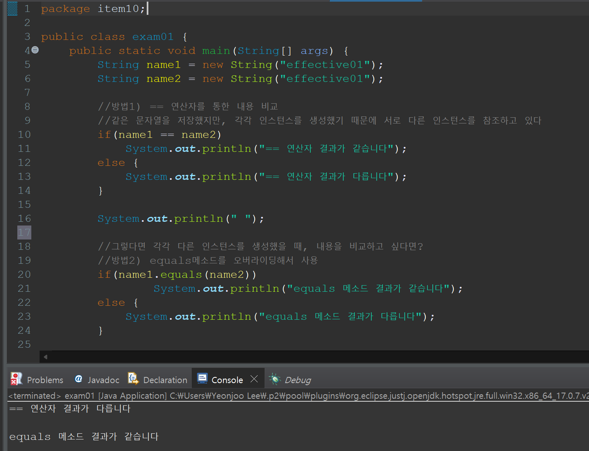
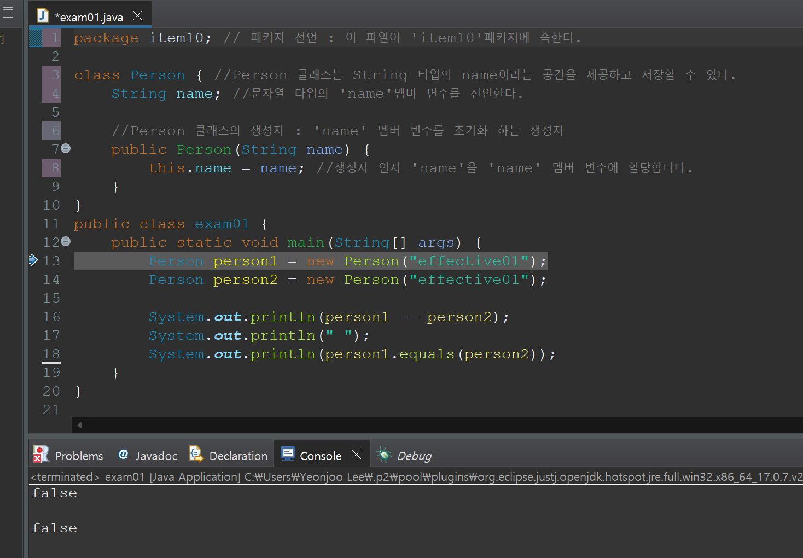
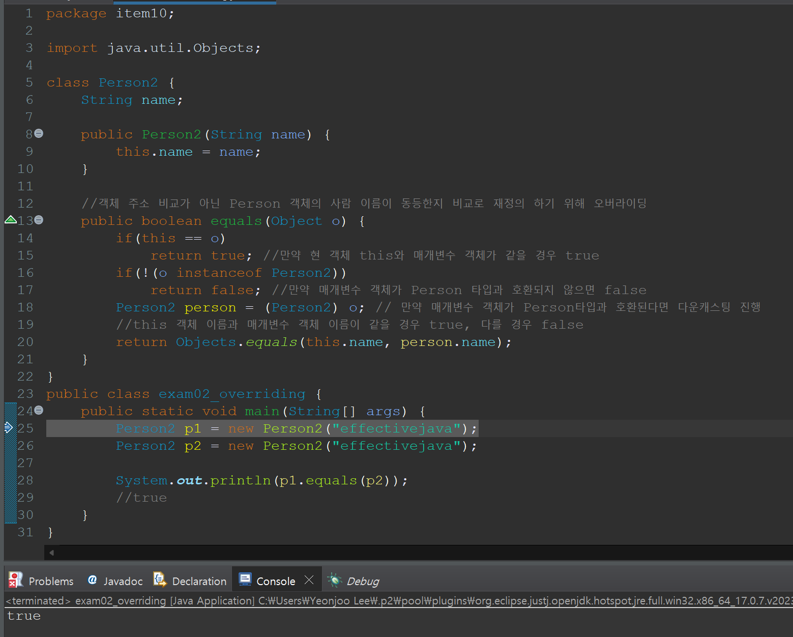

# 3장. 모든 객체의 공통 메서드
Object는 객체를 만들 수 있는 구체 클래스지만 기본적으로 상속해서 사용하도록 설계되었다. 
그래서 Object에서 final이 아닌 메서드(equals, haschCode, toString, clone, finalize)는 모두 재정의(overriding)을 염두에 두고 설계된 것이라 재정의 시 지켜야 하는 일반 규약이 명확히 정의되어 있다. <br> 그래서 Object를 상속하느 클래스, 즉 모든 클래스는 이 메서드 들을 일반 규약에 맞게 재정의해야 한다. 메서드를 잘못 구현하면 오동작한다. 


**요약** <br>
> 꼭 필요한 경우가 아니면 equals를 재정의하지 말자, 많은 경우에 Object의 equals가 여러분이 원하는 비교를 정확히 수행해준다. 재정의해야 할 때는 그 클래스의 핵심 필드 모두를 빠짐 없이, 다섯 가지 규약을 확실히 지켜가며 비교해야 한다.


## 🔎 equals ?
- == 연산자와 equals 메소드가 서로 비교해서 설명을 자주 하니, == 연산자와 equals 메소드를 비교해보자.
<div align='center'>
    
</div>
사진에서 볼 수 있듯. equals 메소드를 이용해서 인스턴스의 내용을 비교할 수 있다.
하지만 이것은 String타입의 변수를 비교할 때만 가능하고

- 비교 대상이 객체일 경우에는 둘 다 객체의 주소를 이용해서 비교하기 때문에 == 연산자나 equals()나 똑같다.
<div align='center'>
    
</div>
String이 아닌 객체끼리 비교했을 때, 주소값을 비교하기 때문에 결과가 false가 나옴.

컴퓨터의 관점에서 바라봤을 때 같은 문자열을 저장하고 있지만, person1, person2 객체가 서로다른 힙영역제 저장되어있으니, 당연히 주소가 일치하지 않는다. 하지만 사람의 입장에서 person1과 person2를 보면 같은 문자열을 가지고 있으니 같은 데이터라고 볼 수 있다. 

이렇게 객체 자료형을 비교할 때, 주소 값이 아닌 객체의 필드값을 기준으로 비교를하고 싶다면, equals 메소드를 오버라이딩해서 주소가 아닌 필드값으로 비교하도록 재정의 해주면 된다.

### 🔎 재정의 ?
- 메소드를 내가 직접 정의하겠다.
- 아래에서 equals 메소드에 대해서 재정의 해보자

#### 🔎원래 eqauls 메소드(Object class에서 확인가능)
```
    public boolean equals(Object obj) {
        return (this == obj);
    }
```


#### 🔎 재정의한 equals 메소드
```
public boolean equals(Object o) {
		if(this == o) 
			return true; //만약 현 객체 this와 매개변수 객체가 같을 경우 true
		if(!(o instanceof Person2))
			return false; //만약 매개변수 객체가 Person 타입과 호환되지 않으면 false
		Person2 person = (Person2) o; // 만약 매개변수 객체가 Person타입과 호환된다면 다운캐스팅 진행
		//this 객체 이름과 매개변수 객체 이름이 같을 경우 true, 다를 경우 false
		return Objects.equals(this.name, person.name);
	}
}
```

이렇게 메소드를 다시 내가 재정의 해주는 코드를 작성해준다. 그러면 객체의 데이터를 비교해주는 메소드가 만들어진다.

<div align='center'>
    
</div>
## 🔎 논리적 vs 물리적 동치성 비교
### 논리적 동치성 비교(equals) ?
- 논리적 동치성 비교란 참조 타입(Reference Type) 변수를 비교하는 것이다. 더 정확히 말하면 비교할 핵심 값을 정하고, 핵심 값을 비교하여 두 객체가 서로 동등(equal)한다면 논리적으로 같다라고 한다.
- 즉, 사용자가 만든 클래스에 논리적 동치성 비교가 필요하다면 직접 오버라이딩하여 코드를 작성해야한다. 

### 물리적 동치성 비교 ?
- 메모리게 저장된 주소 값이 동일하는지 확인


> equals를 재정의 해야할 때는 같은 데이터 타입인지, 논리적 동치성을 확인해야 하는데, equals가 논리적 동치성을 비교하도록 재정의되지 않았을 때다.
근데 eqauls 메서드를 재정의 하기위해서는 4가지 조건 중 하나에 해당한다면 재정의 하지 않는 것이 최선이고,
재정의 하려면 5가지 규약을 따라야 한다.

## ✔️ equals 메서드를 재정의하면 안되는 4가지 조건
1. 각 인스턴스가 본질적으로 고유하다.
2. 인스턴스의 논리적 동치성(logical equality)을 검사할 일이 없다. 
3. 상위 클래스에서 재정의한 equals가 하위 클래스에도 딲 들어맞는다. 
4. 클래스가 private이거나 package-private이고 equals메서드를 호출할 일이 없다. 
    - equals가 실수로 호출되는 걸 막고 싶다면
    ```
    @Override
    public boolean equals (Object o){
        throw new AssertionError(); //equals 호출 시 error();
    }
    ```
## ✔️ equals를 재정의해야할 때?
논리적 통치성을 확인해야 하는데, 상위 클래스의 equals가 논리적 동치성을 비교하도록 재정의되지 않았을 때 ! 

<br><br>

## ✔️ equals 메서드를 재정의할 때 반드시 따라야할 일반 규약(Object 명세에 적힌 규약) - equals 메서드는 동치관계를 구현하며, 다음을 만족한다(동치 관계를 만족 시키기 위한 5가지 요건) 

#### 🔎 동치 클래스(equivalence class) : 집합을 서로 같은 원소들로 이루어진 부분집합으로 나누는 연산. 이 equals 메서드가 쓸모 있으려면 모든 원소가 같은 동치류에 속한 어던 원소와도 서로 교환할 수 있어야 한다. 

### 반사성(reflexivity)
- null이 아닌 모든 참조 값 x에 대해, x.equals(x)는 true다.
- 단순히 말하면 객체는 자기 자신과 같아야 한다는 뜻이다. 

### 대칭성(symmetry) 
- null이 아닌 모든 참조 값 x,y에 대해, x.equals(y)가 true면 y.equals(x)도 true다.
- 두 객체는 서로에 대한 동치 여부에 독같이 답해야 한다는 뜻이다.

### 추이성(transitivity)
- null이 아닌 모든 참조 값 x,y,z에 대해, x.equals(y)가 true고 t.equals(z)도 true면 x.equals(z)도 true다.
- 첫 번째 객체와 두 번째 객체가 같고, 두 번째 객체와 세 번째 객체가 같다면, 첫 번째 객체와 세 번째 객체도 같아야 한다는 뜻이다. 

### 일관성(consistency)
- null이 아닌 모든 참조 값 x,y,에 대해 x.equals(y)를 반복해서 호출하면 항상 true를 반환하거나 항상 false를 반환한다
- 두 객체가 같다면 앞으로도 영원히 같아야 한다는 뜻이다.
- 클래스가 불면이든 가변이든 equals의 판단에 신뢰할 수 없는 자원이 끼어들게 해서는 안된다. 
> 예를 들면 java.net.URL의 equals는 주어진 URL과 매핑된 호스트의 IP주소를 이용해 비교한다. 호스트 이름을 IP주소로 바꾸려면 네트워크를 통해야하는데 그 결과각 항상 같다고 보장할 수 없다. 이는 URL의 equals가 일반 규약을 어기게 하고 **실무에서도 종종 문제를 일으킨다** 절대 따라 해서는 안된다.

### null-아님 
- null이 아닌 모든 참조 값 x에 대해, x.equals(null)은 false다.
- 모든 객체가 null과 같지 않아야 한다는 뜻이다. 의도하지 않았음에도 NullPointerException을 던지는 코드는 흔할 것이다. 이런 경우도 허용하지 않는다. 


## ✔️ 양질의 eqauls 메서드 구현 방법
 **1. == 연산자를 사용해 입력이 자기 자기 자신의 참조인지 확인한다.**
 자기 자신이면 true를 반환한다. 이는 단순한 성능 최적화용으로, 비교 작업이 복잡한 상황일 때 값어치를 할 것이다.

 **2. instanceof 연산자로 입력이 올바른 타입인지 확인한다.** 

 **3. 입력을 올바른 타입으로 형변환한다.** 

 **4. 입력객체와 자기 자신의 대응되는 '핵심'필드들이 모두일치하는지 하나씩 검사한다.**

 ## 코드 구현 10-6
 ```
 // PhoneNumber 클래스를 정의합니다.
public final class PhoneNumber {
    // 전화번호의 구성 요소로 사용할 필드를 선언합니다.
    private final short areaCode, prefix, lineNum;

    // 생성자를 정의합니다. 이 생성자를 사용하여 PhoneNumber 객체를 생성할 수 있습니다.
    public PhoneNumber(int areaCode, int prefix, int lineNum) {
        // 생성자에서 주어진 값들을 범위 확인 함수인 rangeCheck를 사용하여 검사하고 필드에 저장합니다.
        // 각 필드는 정해진 범위 내의 값을 가져야 합니다.
        this.areaCode = rangeCheck(areaCode, 999, "지역코드");
        this.prefix = rangeCheck(prefix, 999, "프리픽스");
        this.lineNum = rangeCheck(lineNum, 9999, "가입자 번호");
    }

    // 주어진 값이 특정 범위 내에 있는지 확인하는 private 메서드를 정의합니다.
    private static short rangeCheck(int val, int max, String arg) {
        if (val < 0 || val > max) {
            // 범위를 벗어난 경우 IllegalArgumentException 예외를 던집니다.
            throw new IllegalArgumentException(arg + ": " + val);
        }
        return (short) val;
    }

    // equals 메서드를 재정의하여 두 PhoneNumber 객체의 내용을 비교합니다.
    @Override
    public boolean equals(Object o) {
        if (o == this) {
            return true; // 자기 자신과 비교하는 경우 true를 반환합니다.
        }
        if (!(o instanceof PhoneNumber)) {
            return false; // 비교 대상이 PhoneNumber 객체가 아닌 경우 false를 반환합니다.
        }
        PhoneNumber pn = (PhoneNumber) o;
        // 각 필드를 비교하여 두 객체가 동일한 전화번호를 나타내면 true를 반환합니다.
        return pn.lineNum == lineNum && pn.prefix == prefix && pn.areaCode == areaCode;
    }
}
 ```
**5. equals를 재정의할 땐 hashCode도 반드시 재정의하자(item11)**
**6. 너무 복잡하게 해결하려 들지말자**
필드들의 동치성만 검사해도 equals 규약을 지킬 수 있다.
**7. Object 외의 타입을 매개변수로 받는 equals 메서드는 선언하지 말자**

### equals를 작성하고 테스트 작업을 대신해주는 오픈 소스 ? AutoValue 프레임워크 !
클래스에 어노테이션 하나만 추가하면 AutoValue가 메서드들을 알아서 작성해준다.

--- 
### 📌 Reference
- 자바 equals / hashCode 오버라이딩 - 완벽 이해하기 : https://inpa.tistory.com/entry/JAVA-%E2%98%95-equals-hashCode-%EB%A9%94%EC%84%9C%EB%93%9C-%EA%B0%9C%EB%85%90-%ED%99%9C%EC%9A%A9-%ED%8C%8C%ED%97%A4%EC%B9%98%EA%B8%B0
- [JAVA] '=='와 'Equals' 비교 분석 : https://javanitto.tistory.com/9
- 자바 String 타입 특징 이해하기 (String Pool & 문자열 비교) : https://inpa.tistory.com/entry/JAVA-%E2%98%95-String-%ED%83%80%EC%9E%85-%ED%95%9C-%EB%88%88%EC%97%90-%EC%9D%B4%ED%95%B4%ED%95%98%EA%B8%B0-String-Pool-%EB%AC%B8%EC%9E%90%EC%97%B4-%EB%B9%84%EA%B5%90
- https://jyami.tistory.com/66 