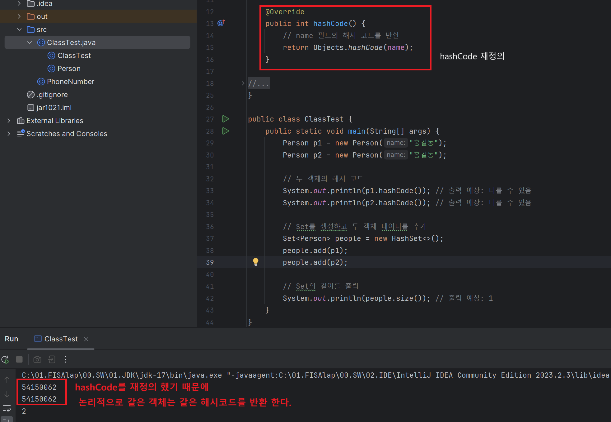
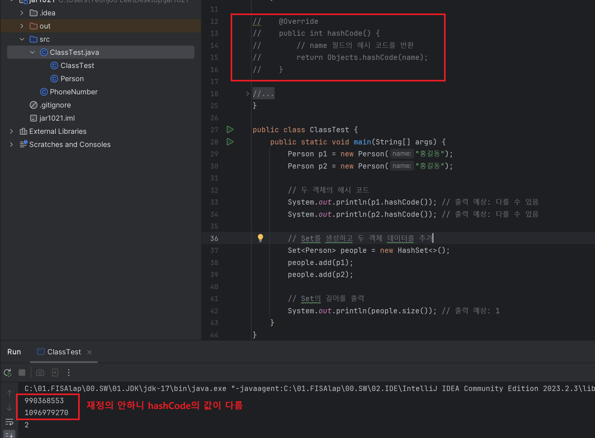

**요약** <br>
> equals를 재정의할 때는 hashCode도 반드시 재정의 해야 한다. 그렇지 않으면 프로그램이 제대로 동작하지 않을 것이다. AutoValue 프레임워크를 사용하면 자동으로 만들어 준다. IDE들도 이런 기능을 일부 제공한다.


## 🔎 hashCode ?
- 디폴트로는 객체의 주소값을 이용해서 hashing 기법을 통해 해시코드를 만들 후 반환해주는데, 따라서 서로 다른 두객체는 같은 해시코드를 가질 수 없다. 그래서 해시코드는 객체의 지문이라고도 함. 객체의 주소가 아닌 다른 데이터의 주소를 반환하기 위해선 역시 오버라이디 하여 재정의 해주어야 한다. 

```
   @IntrinsicCandidate
    public native int hashCode();
```

## 🔎 예시 코드
```
import java.util.HashSet;
import java.util.Objects;
import java.util.Set;

class Person {
    public String name;

    public Person(String name) {
        this.name = name;
    }

    @Override
    public int hashCode() {
        // name 필드의 해시 코드를 반환
        return Objects.hashCode(name);
    }

    @Override
    public boolean equals(Object obj) {
        if (this == obj) return true;
        if (obj == null || getClass() != obj.getClass()) return false;
        Person person = (Person) obj;
        return Objects.equals(name, person.name);
    }
}

public class ClassTest {
    public static void main(String[] args) {
        Person p1 = new Person("홍길동");
        Person p2 = new Person("홍길동");

        // 두 객체의 해시 코드
        System.out.println(p1.hashCode()); // 출력 예상: 다를 수 있음
        System.out.println(p2.hashCode()); // 출력 예상: 다를 수 있음

        // Set를 생성하고 두 객체 데이터를 추가
        Set<Person> people = new HashSet<>();
        people.add(p1);
        people.add(p2);

        // Set의 길이를 출력
        System.out.println(people.size()); // 출력 예상: 1
    }
}

```
결과 확인

<div align='center'>
    
</div>
<div align='center'>
    
</div>

## ✔️ 왜 equals와 hashCode를 같이 재정의 해야하나?
- 자바의 규칙 중에 equals()의 결과가 true인 두 객체의 해시코드는 반드시 같아야 한다가 있기 때문
- 그래서 equals() 재정의할 때 hashCode도 같이 재정의 해줘야한다.
- (참고 블로그에서는 equals메소드 오버라이딩만하면 경고문구가 나온다는데 저는 나오지 않았습니다.. IDE가 저절로 해줘서 그럴까요?)
- 두 메소드를 재정의하지 않을 시, hash값을 사용하는 Collection Framework(HashSet, HashMap, HashTable)을 사용할 때 문제가 발생하기 때문이다.
- 이 메소드들은 동작순서가 hashCode()리턴값을 먼저 비교하고 equals()리턴값을 비교하기 때문에 때문에 equals()만 재정의하는 것은 의미가 없게 되는 것이다. 

## 🔎 identityHashCode
- equals()와 hashCode() 메서드를 오버라이딩 해버리면, 반환 동작이 객체의 필드 기준으로 이행되기 때문에, 만일 객체 자체의 주소값(해시코드)를 얻어야 할 상황이 온다면 난감하다. 
- 그래서 자바에서는 똑같이 해시코드를 반환해주는 매서드인 identityHashCode()를 만들었다.
- 즉, 오버라이딩 하기 전의 원래의 기능이 필요할 때 사용하는 메서드이다.


## ✔️ 좋은 hashCode를 작성하는 요령
1. int 변수 result를 선언한 후 값c로 초기화한다. 이때 c는 해당 객체의 첫번째 핵심 필드를 단계 2.a 방식으로 계산한 해시코드다(여기서 핵심 필드란 equals비교에 사용되는 필드를 말한다.)
2. 해당 객체의 나머지 핵심 필드 f 각각에 대해 다음 작업을 수행한다.
    a. 해당 필드의 해시코드 c를 계산한다.
        i. 기본 타입 필드라면, Type.hashCode(f)를 수행한다. 여기서 Type은 해당 기본 타입의 박싱 클래스다.
        ii. 참조 타입 필드면서 이 클래스의 equals 메서드가 이 필드의 equals를 재귀적으로 호출해 비교한다면, 이 필드의 hashCode를 재귀적으로 호출한다. 계산이 더 복잡해질 것 같으면, 이필드의 표준형을 만들어 그 표준형의 hashCode를 호출한다. 필드의 값이 null이면 0을 사용한다.(다른 상수도 괜찮지만 전통적으로 0을 사용한다.)
        iii. 필드가 배열이라면, 핵심 원소 각각을 별도 필드처럼 다룬다. 이상의 규칙을 재귀적으로 적용해 각 핵심 원소의 해시코드를 계산한 다음, 단계 2.b 방식으로 갱신한다. 배열에 핵심 원소가 하나도 없다면 단순히 상수(0을 추천한다)를 사용한다. 모든 원소가 핵심 원소라면 Arrays.hashCode를 사용한다.
    b. 단계 2.a에서 계산한 해시코드 c로 result를 갱신한다. `result = 31 * result + c`
3. result를 반환한다.


--- 
### 📌 Reference
- https://inpa.tistory.com/entry/JAVA-%E2%98%95-equals-hashCode-%EB%A9%94%EC%84%9C%EB%93%9C-%EA%B0%9C%EB%85%90-%ED%99%9C%EC%9A%A9-%ED%8C%8C%ED%97%A4%EC%B9%98%EA%B8%B0
- https://inpa.tistory.com/entry/JAVA-%E2%98%95-Object-%ED%81%B4%EB%9E%98%EC%8A%A4%EC%99%80-%EC%83%81%EC%9C%84-%EB%A9%94%EC%84%9C%EB%93%9C-%EC%9E%AC%EC%A0%95%EC%9D%98-%ED%99%9C%EC%9A%A9-%EC%B4%9D%EC%A0%95%EB%A6%AC