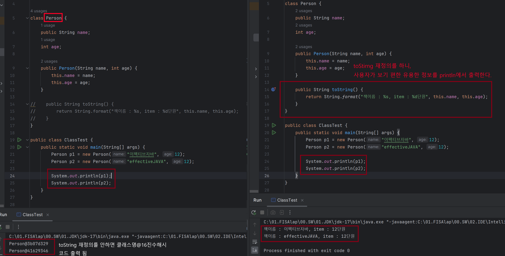

**요약** <br>
> 모든 구체 클래스에서 Object의 toString을 재정의하자. 상위 클래스에서 이미 알맞게 재정의한 경우는 예외다. toString을 재정의한 클래스는 사용하기도 즐거고 그 클래스를 사용한 시스템을 디버깅하기 쉽게 해준다. toString은 해당 객체에 관한 명확하고 유용한 정보를 읽기 좋은 형태로 반환해야 한다.


## 🔎 toString 메소드
- Object의 toString() 메소드는 인스턴스에 대한 정보와 주소를 문자열로 반환한다.
- ex. 클래스_이름@16진수의_해시코드
- ex. Person@3b07d329
- toString() 메소드
```
  public String toString() {
        return getClass().getName() + "@" + Integer.toHexString(hashCode());
    }
```
- toString 메소드 재정의 전후비교.img
<div align='center'>
    
</div>

<br><br>
## ✔️ toString 메소드를 재정의 하는 이유
- toString의 일반 규약에 따르면 '간결하면서 사람이 읽기 쉬운 형태의 유익한 정보'를 반환해야하는데 16진수의 해시코드보다 "effectiveJAVA, item 12"처럼 정보를 직접알려주는 형태가 훨씬 유익한 정보이다.
- 그렇기 때문에 사용자 친화적인 정보를 출력하기 위해 toString 메소드를 재정의한다.
- toString 메서드는 객체를 println, printf, +(문자열 연결 연산자), asser구분에 넘길 때, 혹은 디버거가 객체를 출력할 때 자동으로 불린다.
- 그래서 toString 메서드를 재정의하지 않으면 쓸모 없는 메세지만 로그에 남는다.
<br><br>
## ✔️ 좋은 toString 재정의
- toString은 그 객체가 가진 주요 정보 모두를 반환하는 게 좋다.
- toString을 구현할 때, 반환값의 포맷을 문서화할지 정해야 한다. 
- 전화번호나 행렬 같은 값 클래스라면 문서화하기를 권한다. 포맷을 명시하면 그 객체는 표준적이고, 명확하고, 사람이 읽을 수 있게 된다.
- 따라서 그 값 그대로 입출력에 사용하거나 CSV 파일처럼 사람이 읽을 수 있는 데이터 객체로 저장할 수도 있따. 포맷을 명시하기로 했다면, 명시한 포맷에 맞는 문자열과 객체를 상호 전환할 수 있는 정적 팩터리나 생성자를 함께 제공해주면 좋다.
- BigInteger, BigDecimal과 대부분의 기본 타입 클래스가 여기 해당한다.
<br><br>
## ✔️ 포맷을 명시했을 때 단점
- 평생 그 포맷에 얽매이게 되어, 그 포맷에 맞춰 파싱하고, 새로운 객체를 만들고 영속 데이터르 저장하는 코드를 작성한다.
- 만약 향후 포맷을 바꾼다면 그 포맷을 사용하던 코드와 데이터들은 엉망이 될 것이다.
> 포맷을 명시하지 않으면 향후 정보를 더 넣거나 포맷을 개선할 수 있는 유연성을 얻게 된다

<br>

### ❓ 그러면 어떻게 하란 말인가?
> - 포맷을 명시하든 아니든 의도는 명확히 밝혀야 한다.
> - 포맷 명시 여부와 상관없이 toString이반환 값에 포함된 정보를 얻어올 수 있는 API를 제공하자.
> - AutoValue 프레임워크를 사용해보자


--- 
### 📌 Reference
- https://inpa.tistory.com/entry/JAVA-%E2%98%95-toString-%EB%A9%94%EC%84%9C%EB%93%9C-%EC%9E%AC%EC%A0%95%EC%9D%98-%EC%99%84%EB%B2%BD-%EC%9D%B4%ED%95%B4%ED%95%98%EA%B8%B0
- https://inpa.tistory.com/entry/JAVA-%E2%98%95-Object-%ED%81%B4%EB%9E%98%EC%8A%A4%EC%99%80-%EC%83%81%EC%9C%84-%EB%A9%94%EC%84%9C%EB%93%9C-%EC%9E%AC%EC%A0%95%EC%9D%98-%ED%99%9C%EC%9A%A9-%EC%B4%9D%EC%A0%95%EB%A6%AC