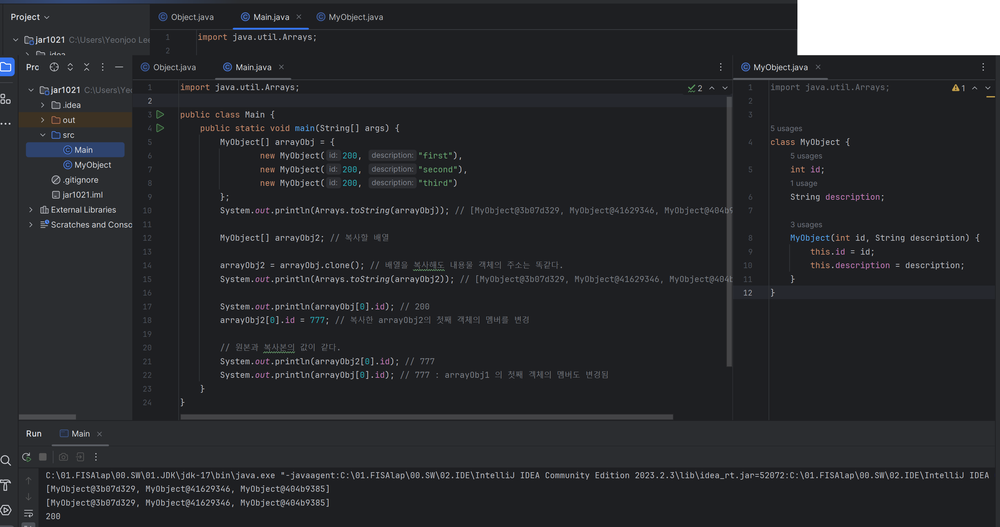
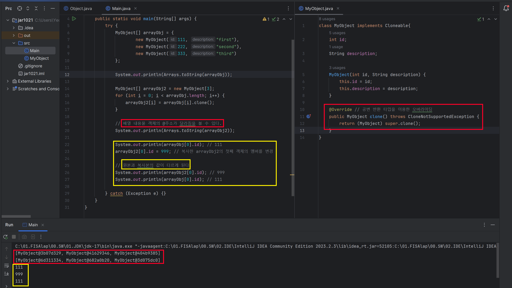

**요약**  
> Cloneable이 몰고 온 모든 문제를 되짚어봤을 때, 새로운 인터페이스를 만들 때는 절대 Cloneable을 확장해서는 안되며, 새로운 클래스도 이를 구현해서는 안된다 final클래스라면 Cloneable을 구현해도 위험이 크지 않지만, 성능최적화 관점에서 검토한 후 별다른 문제가 없을 때만 드물게 허용해야 한다. 기본 원칙은 '복제 기능은 생성자와 팩터리를 이용하는 게 최고'라는 것이다. 단, 배열만은 clone 메서드 방식이 가장 깔끔한, 이 규칙의 합당한 예외라고 할 수 있다.
 

## 🔎 clone() 메소드 ?
- Object.clone() 메소드는 인스턴스 객체의 복제를 위한 메소드로, 해당 인스턴스를 복제해서 새로운 인스턴스를 생성하고 그 참조값을 반환한다.
- clone() 메소드를 사용하기 위해서는 오버라이딩을 해야 되는데, 데이터 보호의 이유로 Cloneable 인터페이스를 구현한 클래스의 인스턴스만이 사용할 수 있다.
- clone()메소드는 기본적으로 protected 접근 권한을 갖고 있기 때문에, 상속하여 메소드르 public 접근제어자로 재정의하여 어디서나 복제가 가능하도록 해야 한다.
- 객체를 깊은 복사할 때 사용되는 메소드
 

### 🔎 얕은 복사(shallow copy) ?
- 자바의 객체와 같은 참조 변수는 직접 값을 저장하는 것이 아니라 데이터는 Heap영역에 저장하고, Heap영역의 주소를 저장한다.
- 그래서 기본형 타입(int, double ..)이 아닌 객체와 같은 참조형 타입의 변수를 그대로 복제 한다면 데이터가 복사되는 것이 아니라 Heap영역의 주소값이 영역되어 결국 같은 Heap영역의 데이터를 바라보는 것이다.
- 이런 복사를 얕은 복사(shallow copy)라고 하며, 얕은 복사에서는 원본을 변경하면 복사본도 영향을 받는다(왜? 같은 heap메모리를 보고 있으니까) 
### 🔎 깊은 복사(deep copy) ?
- 원본과 복사본의 데이터는 같지만 다른 힙데이터를 바라보고 있기 때문에 hashCode의 값이 다르다.
- 원본이 참조하고 있는 heap의 데이터까지 복제하는 것을 깊은 복사라고한다.
- 원본을 변경해도 복사본에 영향을 끼치지 않는다. 

### 깊은 복사 주의 사항
- 간단한 단일 클래스 타입은 그대로 복제가 가능하지만, 클래스 타입을 여러개 담고 있는 배열을 복제할 때는 주의 사항이 따른다.
- 참조 객체인 배열 자체는 완벽히 복사 되었지만, 배열 내용물 객체는 얕은 복사가 되어서 원본 배열의 데이터와 복사된 배열의 데이터가 가르키는 주소값이 같다(Heap 데이터가 같다)
- 복사된 배열의 데이터를 변경했더니.. 원본 배열의 데이터도 변경되었다..

    

## clone() 메소드 오버라이딩
> 앞의 상황처럼 클래스를 복사할 경우 clone()을 오버라이딩해야 완벽히 복사(깊은 복사)가 된다
> 데이터의 형태가 객체와 같은 reference 타입일 경우 clone 메서드를 재정의해야 된다라고 암기하자
- 

    

## ✔️ 학습내용
1. clone() 메서드를 잘 동작하게끔 해주는 구현 방법
2. 언제 그렇게 해야 하는지
3. 가능한 다른 선택지

## ✔️ Cloneable 인터페이스가 하는 일?
- Object의 protected 메서드인 clone의 동작 방식을 결정한다.
- Cloneable을 구현한 클래스의 인스턴스에서 clone을 호출하면 그 객체의 필드를 하나하나 복사한 객체를 반환하며, 그렇지 않은 클래스의 인스턴스에서 호출하면 CloneNotSupportExceprion을 던진다
- 따라하지는 말자. 보통 인터페이스를 구현한다는 것은 일반적으로 해당 클래스가 그 인터페이스에서 정의한 기능을 제공한다고 선언하는 행위다.
그런데 Cloneable의 경우에는 상위 클래스에 정의된 protected 메서드의 동작 방식을 변경한 것이다.

> clone() 메서드는 사실상 생성자와 같은 효과를 낸다. 즉, clone은 원본 객체에 아무런 해를 끼치지 않는 동시에 복제된 객체의 불변식을 보장해야 한다.

--- 
### 📌 Reference
- https://inpa.tistory.com/entry/JAVA-%E2%98%95-Object-%ED%81%B4%EB%9E%98%EC%8A%A4%EC%99%80-%EC%83%81%EC%9C%84-%EB%A9%94%EC%84%9C%EB%93%9C-%EC%9E%AC%EC%A0%95%EC%9D%98-%ED%99%9C%EC%9A%A9-%EC%B4%9D%EC%A0%95%EB%A6%AC
- https://inpa.tistory.com/entry/JAVA-%E2%98%95-Object-%ED%81%B4%EB%9E%98%EC%8A%A4-clone-%EB%A9%94%EC%84%9C%EB%93%9C-%EC%96%95%EC%9D%80-%EB%B3%B5%EC%82%AC-%EA%B9%8A%EC%9D%80-%EB%B3%B5%EC%82%AC