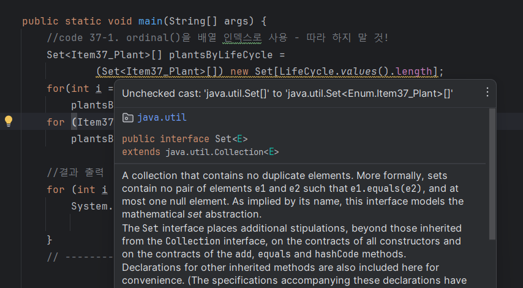

### ordinal( )

- 몇 번째 객체인지 알려줌

```java
package Enum;

import java.util.HashSet;
import java.util.Set;

public class Item37_Plant {
    enum LifeCycle { ANNUAL, PERENNIAL, BIENNIAL}

    final String name;
    final LifeCycle lifeCycle;

    Item37_Plant(String name, LifeCycle lifeCycle) {
        this.name = name;
        this.lifeCycle= lifeCycle;
    }

    @Override public String toString() {
        return name;
    }

    public static void main(String[] args) {
        Set<Item37_Plant>[] plantsByLifeCycle =
                (Set<Item37_Plant>[]) new Set[LifeCycle.values().length];
        for(int i = 0; i < plantsByLifeCycle.length; i++)
            plantsByLifeCycle[i] = new HashSet<>();
        for (Item37_Plant p : garden)
            plantsByLifeCycle[p.lifeCycle.ordinal()].add(p);

        //결과 출력
        for (int i = 0; i < plantsByLifeCycle.length; i++){
            System.out.printf("%s: %s%n",
                    Item37_Plant.LifeCycle.values()[i], plantsByLifeCycle[i]);
        }
    }
}
```

**문제점.**
<div align='center'>
    
</div>

- 배열은 제네릭과 호환되지 않아서 비검사 형변환을 수행해야 하고 깔끔히 컴파일되지 않음
- 배열은 각 인덱스의 의미를 모르니 출력 결과에 직접 레이블을 달아야 한다.
- (가장 심각한 문제)정수는 열거 타입과 달리 타입 안전하지 않아서 개발자가 정확한 정수값을 사용한다는 것을 직접 보증해야한다.

### EnumMap (해결책 : 열거 타입을 키로 사용하도록 설계한 아주 빠른 Map 구현체)

코드 37-2

```java
Map<LifeCycle, Set<Plant>> plantsByLifeCycle = new EnumMap<>(LifeCycle.class);

for (LifeCycle lifeCycle : LifeCycle.values()) {
	plantsByLifeCycle.put(lifeCycle,new HashSet<>());
}

for (Plant plant : garden) {
	plantsByLifeCycle.get(plant.lifeCycle).add(plant);
}

System.out.println(plantsByLifeCycle);
```

- 짧고 명료하고 안전하지 않은 형변환을 쓰지 않는다.
- 결과를 출력할 때 별도의 레이블을 달지 않아도 된다. (EnumMap의 toString)
- 배열 인덱스를 계산하는 과정에서 오류가 날 가능성이 없다.
- 내부 구현 방식을 안으로 숨겨, Map의 타입 안전성과 배열의 성능 모두를 얻는다.

```java
//코드37-3. 스트림을 사용한 코드1- EnumMap을 사용하지 않는다.
        System.out.println(Arrays.stream(garden)
                .collect(groupingBy(p -> p.lifeCycle)));

//코드 37-4. 스트림을 사용한 코드2- EnumMap을 이용해 데이터와 열거 타입을 매핑했다.
        System.out.println(Arrays.stream(garden)
                .collect(groupingBy(p -> p.lifeCycle,
                () -> new EnumMap<>(LifeCycle.class), toSet())));
```

**EnumMap 이해하기**

- EnumMap은 Enum을 기반으로 하는 특별한 종류의 Map입니다.
- Enum 상수를 키(key)로 사용하여 값(value)을 저장하고 검색하는데 특화되어 있습니다.

```java
import java.util.EnumMap;

enum Season { SPRING, SUMMER, FALL, WINTER }

public class FruitSeason {
    public static void main(String[] args) {
        EnumMap<Season, String> fruitBySeason = new EnumMap<>(Season.class);

        // EnumMap에 값 추가
        fruitBySeason.put(Season.SPRING, "Cherry");
        fruitBySeason.put(Season.SUMMER, "Watermelon");
        fruitBySeason.put(Season.FALL, "Apple");
        fruitBySeason.put(Season.WINTER, "Orange");

        // EnumMap에서 값 가져오기
        System.out.println("In spring, you can enjoy: " + fruitBySeason.get(Season.SPRING));
    }
}
```

<br><br>

---
### 📌 Reference
- https://jjingho.tistory.com/84